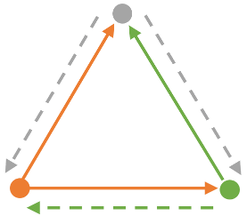

# Introduction #
This tutorial is based on my experiences during the development of the new [terrain texture blending](https://github.com/GarageGames/Torque3D/pull/712).
It's written in the spirit of Daniel Buckmaster's [*"Safari"*](http://www.garagegames.com/community/blogs/view/22767) style documentation, so it's rather a documentation of how the engine works rather than an actual tutorial.

**Author: Lukas p. Joergensen**

## Terrain blocks ##
The terrain is divided into smaller terrain blocks, each terrain block uses one shader to render the whole block, and does not necessarily share this shader with the other blocks. The shader is determined by the textures used in the terrain block, for example if you only use two different textures in the terrain block then the corresponding shader will only handle a maximum of two shaders.

Likewise if the only one of the textures has a normal map, the shader will only handle a maximum of one texture with a normal map.

# Shader gen #
The terrain rendering uses shader gen to generate the shaders it uses to render each terrainblock (so we don't have to write a shader for each terrain rendering case). If we want to change how the terrain is rendered, we need to change the C++ code in *terrFeatureHLSL.cpp* (or *GLSL.cpp) rather than actually writing actual shader code.

How to write shader gen is not covered here, but it is pretty simple to understand when you have a look at it.

In *terrFeatureHLSL.cpp* you'll find different "features" such as *TerrainDetailMapFeatHLSL*, these features are basically the aforementioned "cases". That is, each feature handles a specific case, e.g. *TerrainDetailMapFeatHLSL* handles the rendering of a detail texture. There are two methods which has our primary interest: *"processPix"* and *"processVert"* which generates the shader code for the pixel shader and the vertex shader respectively.

# Detail textures #
As I've worked mostly with detail textures, I will focus my walkthrough on this particular part of the terrain rendering

## DetailBlend ##

To get the linearly interpolated blending value for the current texture you use the current snippet:
```c++
// Calculate the blend for this detail texture.
meta->addStatement( new GenOp( "   @ = calcBlend( @.x, @.xy, @, @ );\r\n", 
                                  new DecOp( detailBlend ), detailInfo, inTex, layerSize, layerSample ) );
```
You will now have a value between 1 and 0 which gives you the linearly interpolated weight of the current detail texture, this is what *"Stock"* T3D uses for it's terrain texture blending (i.e. lerp blending). There is one major issue though, the current texture only blends with the textures before it.

This is illustrated in the image below, where a solid line means that the blend value for that texture is a solid 1, and dashed lines means it linearly interpolated, and the textures are rendered in the following order:

**Orange->Green->Gray**

Which results in the following blending values:




This can be resolved by doing a forward-check on the other detail layers, and subtract their blendvalues as done in [this](https://github.com/GarageGames/Torque3D/pull/710) pull request to fix some lerp-blending artifacts.

## Transferring changes to other features ##
There are 2 render passes for the terrain, one pass for calculating the normal and depth values at each pixel and one for the diffuse. However the all the features are run for both of them, so some of the values you write into the detail feature, can also be used in the corresponding normal feature.

For example, when blending the normal textures together I could simply read the blend values I had calculated in the detail texture, and re-use them like this:
```c++
Var *b1 = (Var*)LangElement::find("b1");
AssertFatal(b1, "The b1 is missing!");
Var *b2 = (Var*)LangElement::find("b2");
AssertFatal(b2, "The b2 is missing!");
```
Now I didn't have to calculate the blend values again, and only had to write my changes once.

# Final off-topic notes #
This was just a simple experiment on writing documentation "Safari" style ala Buckmaster, I wanted to see what value I could produce from just writing down my immediate experiences without having to do a thorough examination and description of how the engine works.

This took me exactly an hour to produce, from the repo was cloned to finish. I'd say it's an easy and enjoyable way to document your findings and I can recommend others to do the same.